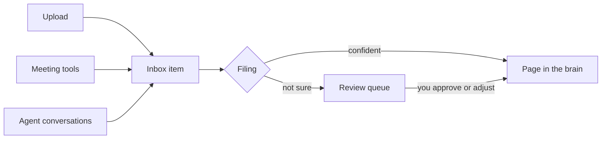

Every brain has an inbox, and everything goes through it. Things you [ask your agent](/capture/asking-your-agent) to save, files you upload, meeting transcripts from connected tools, conversations your agent saves: all of it lands in the inbox first and waits there until it is filed. Nothing writes straight into the brain's pages.

This is the tray on top of the filing cabinet, and it exists for two reasons. First, capture should be effortless: you can throw things in without deciding anything. Second, filing should be accountable: every page in the brain traces back to an inbox item, so you can always see what arrived, when, and what became of it.

## What an item goes through

An inbox item is always in one of four states:

| State | In plain words |
|---|---|
| **Waiting** | Arrived, text extracted, not yet filed. |
| **Being filed** | Someone (Cortex or an agent) is working on it right now. |
| **Needs review** | A filing was suggested but not made. It is parked with the suggestion and the reasoning, waiting for your decision. |
| **Filed** | Done: the knowledge is in the brain as a page, and the item is archived with a record of where it went. |

## Who does the filing

Three hands can file an item, and they all follow the same [skills](/core-concepts#skill):

- **Cortex itself** files straightforward items automatically and parks anything it is not confident about in the review queue. Automatic filing has a daily allowance, so it works steadily rather than running away.
- **Your connected agent** files items when you ask it to, following the same skills, which keeps its filing consistent with everything else.
- **You** can file, adjust or reject anything by hand from the inbox.

If an item repeatedly fails to file cleanly, Cortex stops retrying and parks it in the review queue rather than looping forever.

## Duplicates take care of themselves

Sending the same thing twice does not create two copies. Cortex recognises repeats, both by content and by the sending tool's own reference, and points you back to the existing item instead. Connected tools can safely resend without cluttering your brain.

## Practical limits

Uploads can be Markdown, plain text, PDF, Word or PowerPoint files, up to 50 MB each. Text is extracted on arrival, so even a slide deck becomes searchable words.

## Try it

1. Drag the same file into an inbox twice and watch the second upload point back to the first.
2. Open an item in the review queue and read the suggested filing and its reasoning before approving it.
3. After approving, open the created page and follow its source citation back.
