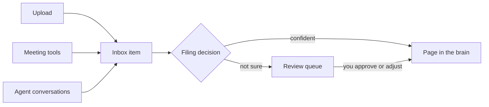

Every brain has an inbox, and everything goes through it. Files you upload, meeting transcripts from connected tools, conversations your agent saves: all of it lands in the inbox first and waits there until it is filed. Nothing writes straight into the brain's pages.

Think of the inbox as the tray sitting on top of the filing cabinet. It exists for two reasons. First, capture should be effortless: you throw things in without deciding anything. Second, filing should be accountable: every page in the brain traces back to an inbox item, so you can always see what arrived, when, and what became of it.

## What an item goes through

An inbox item is always in one of four states:

| State | What it means |
|---|---|
| **Waiting** | Arrived and text extracted, but not yet filed. |
| **Being filed** | Cortex or a connected agent is working on it right now. |
| **Needs review** | A filing suggestion has been made but not committed. The item is parked with the suggestion and the reasoning, waiting for your decision. |
| **Filed** | Done. The knowledge is in the brain as a page, and the item is archived with a record of where it went. |

## Who does the filing

Three parties can file an item, and all of them follow the same [Skills](/filing/skills):

- **Cortex itself** files straightforward items automatically and parks anything it is not confident about in the review queue. Automatic filing works to a daily allowance so it runs steadily rather than getting ahead of itself.
- **Your connected agent** files items when you ask it to, following the same skills, which keeps its filing consistent with everything else in the brain.
- **You** can file, adjust, or reject any item by hand directly from the inbox at any time.

If an item repeatedly fails to file cleanly, Cortex stops retrying and parks it in the review queue rather than looping forever.

## Duplicates take care of themselves

Sending the same thing twice does not create two copies. Cortex recognises repeats both by content and by the sending tool's own reference, and points you back to the existing item instead. Connected tools can safely resend without cluttering your brain.

## Practical limits

Uploads can be Markdown, plain text, PDF, Word (.docx), or PowerPoint (.pptx) files, up to 50 MB each. Text is extracted on arrival, so even a slide deck becomes searchable words.

<CardGroup cols={2}>
  <Card title="Uploading Files" icon="upload" href="/capture/uploading-files">
    Drag in a document and let Cortex read and file it.
  </Card>
  <Card title="Review Queue" icon="list-check" href="/filing/review-queue">
    Handle items Cortex is not confident about filing on its own.
  </Card>
</CardGroup>
