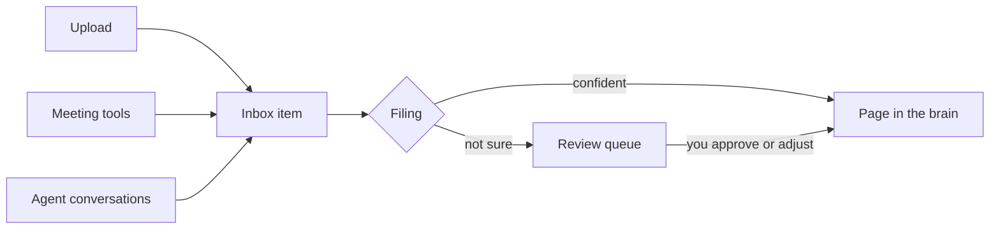

Every brain has an inbox, and everything goes through it. Things you [ask your agent](/capture/asking-your-agent) to save, files you upload, meeting transcripts from connected tools, conversations your agent saves, [mail you forward to your brain's address](/capture/your-email): all of it lands in the inbox first and waits there until it is filed. Nothing writes straight into the brain's pages.

This is the tray on top of the filing cabinet, and it exists for two reasons. First, capture should be effortless: you can throw things in without deciding anything. Second, filing should be accountable: every page in the brain traces back to an inbox item, so you can always see what arrived, when, and what became of it.

```mermaid
flowchart LR
    U[Upload] --> I[Inbox item]
    M[Meeting tools] --> I
    A[Agent conversations] --> I
    I --> F{Filing}
    F -->|confident| P[Page in the brain]
    F -->|not sure| R[Review queue]
    R -->|you approve or adjust| P
```

## What an item goes through

An inbox item is always in one of four states:

| State | In plain words |
|---|---|
| **Waiting** | Arrived, text extracted, not yet filed. |
| **Being filed** | Someone is working on it right now, and the item says who: **your agent**, filing something it uploaded, or **Cortex**. |
| **Needs review** | A filing was suggested but not made. It is parked with the suggestion and the reasoning, waiting for your decision. |
| **Filed** | Done: the knowledge is in the brain as a page, and the item is archived with a record of where it went. |

An item held by your agent stays that way until the agent archives it. If the agent starts and does not finish within 30 minutes (the conversation ended, say), the item moves to **Needs review** with a note saying so, for a person to decide. Cortex never takes over an item an agent was filing.

In a [partitioned brain](/brains/partitions) an item also carries which client (or site, or matter) it belongs to, decided when it arrives. One that could not be decided shows as **needs a client** alongside its state, and nothing files from it until someone says which.

## Who does the filing

Three hands can file an item, and they all follow the same [skills](/core-concepts#skill). Which one does it depends on how the item arrived:

- **Your connected agent** files whatever it uploads: a document you handed it, a transcript, a note. It does that in the same conversation, with its own tokens, and the item shows as held by your agent while it works. It can also file a waiting item when you ask it to.
- **Cortex itself** files what arrives with nobody present: web uploads, webhook deliveries, session hooks, files sent from the command line. It files straightforward items automatically, parks anything it is not confident about in the review queue, and works under the workspace's monthly ingestion limit.
- **You** can file, adjust or reject anything by hand from the inbox.

[How ingestion is paid for](/filing/how-ingestion-is-paid-for) explains the two lanes and the monthly limit. If an item repeatedly fails to file cleanly, Cortex stops retrying and parks it in the review queue rather than looping forever.

## Duplicates take care of themselves

Sending the same thing twice does not create two copies. Cortex recognises repeats, both by content and by the sending tool's own reference, and points you back to the existing item instead. Connected tools can safely resend without cluttering your brain.

## A newer version of a document

Documents get edited. When an item arrives that Cortex can tell is the same document as one it already holds, because it came with the same link or the same provider id, it is kept as a **revision**: a new item, linked to the earlier one, with the earlier one marked as superseded. Both stay in Sources, so a citation made from the earlier version still points at exactly what was read.

Whoever files the new version is told which pages the earlier one fed and shown what changed between the two, so an update rewrites those pages rather than starting again. Nothing is filed automatically just because a document changed: the brain's [filing mode](/filing/auto-ingest) applies as for any new item, so in a shared brain on Suggest the update waits in the [review queue](/filing/review-queue) for a person.

Sending the same version twice is still a duplicate, and points you back to the item you already have.

## Archiving and deleting

A filed item is **archived**: it stays in the brain's Sources as the permanent record of what was read, and every page filed from it cites it. That is the normal end of an item's life. [Mail](/capture/your-email) is the one exception: the record stays in Sources, but the message itself is destroyed as the item is archived, so there is nothing to read back beyond the link to your mailbox.

A brain admin can also **delete** an item, from the Delete link beside Archive on the item. Deleting removes the item, its original file and its extracted text for good. Use it for something that should never have arrived, or when clearing a brain out for a fresh start. Pages that were filed from a deleted item keep their source note, but the note now points at nothing, so archive is the right choice for anything a page still relies on.

## Practical limits

Uploads can be Markdown, plain text, PDF, Word or PowerPoint files, up to 50 MB each. Text is extracted on arrival, so even a slide deck becomes searchable words.

## Try it

1. Drag the same file into an inbox twice and watch the second upload point back to the first.
2. Open an item in the review queue and read the suggested filing and its reasoning before approving it.
3. After approving, open the created page and follow its source citation back.
