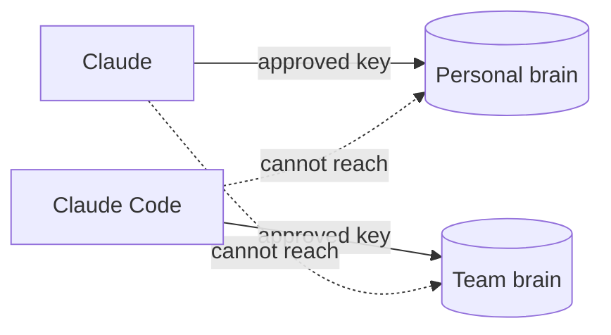

Connecting an AI agent to Cortex is how your agent gains a memory. Once connected, it can search a brain, read its pages, and file new things into it, all in the course of a normal conversation.

The single most important rule is this: **a connection links one agent to one brain, and it can only ever reach that one brain.** Not "one at a time by default", not "unless you change a setting". The key is cut for one cabinet, and it opens nothing else.

## Approving a connection

When you connect an agent, Cortex shows you an approval screen before anything is granted. It names two things in plain sight:

- **Which brain** the agent is asking to reach.
- **What it will be allowed to do** there, its access level (read, or read and write).

You approve, and the agent gets a key scoped to exactly that. It never receives a master key, and it can never widen its own access. If an agent only asked for one brain, that is all its key will ever open.

## Why one brain per connection

It would be simpler to hand an agent one connection and let it pick a brain per request. Cortex deliberately does not, because that would put the privacy boundary in the agent's hands: a single slip in the agent's reasoning could write your private notes into a shared brain.

Instead the boundary is physical. Each connection carries a key that reaches one brain, so the worst an agent can do by getting confused is look in the wrong place. It cannot leak private content into a shared brain, because the key for your personal brain simply cannot write anywhere else. [More on using several brains at once.](/connect/multiple-brains)

## Taking access back

Every connection is listed on the brain's Connect page under Connected Agents, and each one can be revoked on its own. Revoking a connection destroys exactly that key and nothing else: your other agents keep working, and the agent you revoked immediately loses all access to that brain.

## Try it

1. Open any brain's **Connect** page and find the Connected Agents list.
2. Connect an agent (see the guides that follow), then refresh and see it appear.
3. Revoke it, and confirm the agent can no longer reach the brain.

<CardGroup cols={2}>
  <Card title="Connect Claude" icon="comment" href="/connect/claude">
    claude.ai and Claude Desktop.
  </Card>
  <Card title="Connect Claude Code" icon="terminal" href="/connect/claude-code">
    The command-line agent.
  </Card>
  <Card title="Connect ChatGPT" icon="robot" href="/connect/chatgpt">
    Custom connectors in ChatGPT.
  </Card>
  <Card title="Other MCP clients" icon="plug" href="/connect/other-clients">
    Cursor and anything MCP-capable.
  </Card>
</CardGroup>
