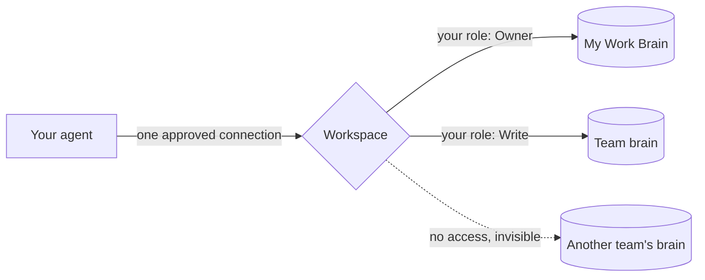

Connecting an AI agent to Cortex is how your agent gains a memory. Once connected, it can search your brains, read their pages, and file new things into them, all in the course of a normal conversation.

A connection links an agent to your **workspace**, acting as you. Through that one connection the agent can reach every brain your access list allows, with exactly the role you hold on each: read where you can read, write where you can write, and nothing at all where you have no access. It never receives more than you have, and it can never widen its own access.

## Approving a connection

When you connect an agent, Cortex shows you an approval screen before anything is granted. It names two things in plain sight:

- **Which workspace** the agent is asking to join.
- **Who it will act as**: you, with your workspace role shown.

You approve, and the agent gets a key scoped to that workspace. What it can do inside is not frozen into the key: every call the agent makes is checked live against your current brain memberships. If a teammate grants you a new brain, your agent can use it on its next request. If your access to a brain is removed, the agent loses it just as fast.

## How the agent knows what it can reach

On connecting, the agent can ask Cortex who it is and what it can see. It gets back the workspace, your role, and the list of brains you can access, each with its purpose and your role there. Tools that write require the agent to name the brain it is writing to, and Cortex only offers it the brains you can actually write. Asked to write somewhere it cannot, the agent gets a clear refusal that explains the alternatives, such as [promoting](/brains/promoting) from a brain it can write to.

This is why a brain's description matters: it is what your agents read to decide where things belong. A one-line description of what a brain is for pays for itself every day.

## Taking access back

Every connection is listed under **Connected Agents** on the Connect page, and each one can be revoked on its own. Revoking a connection destroys exactly that key and nothing else: your other agents keep working, and the revoked agent immediately loses access to the workspace. Removing your access to a single brain, meanwhile, does not need any revoking, because access is checked live: the agent simply stops being able to reach that brain.

## Try it

1. Open a brain's **Connect** page and find the Connected Agents list.
2. Connect an agent (see the guides that follow), then refresh and see it appear.
3. Revoke it, and confirm the agent can no longer reach your brains.

<CardGroup cols={2}>
  <Card title="Connect Claude" icon="comment" href="/connect/claude">
    claude.ai and Claude Desktop.
  </Card>
  <Card title="Connect Claude Code" icon="terminal" href="/connect/claude-code">
    The command-line agent.
  </Card>
  <Card title="Connect ChatGPT" icon="robot" href="/connect/chatgpt">
    Custom connectors in ChatGPT.
  </Card>
  <Card title="Other MCP clients" icon="plug" href="/connect/other-clients">
    Cursor and anything MCP-capable.
  </Card>
</CardGroup>
