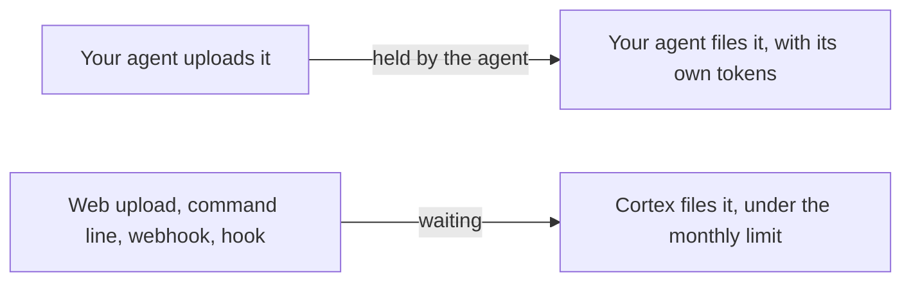

Ingestion is the work of turning an inbox item into pages: something has to read it, decide where it belongs, write the pages and cite the source. An AI does that work, and it costs tokens. Which door an item came through decides who does the work and who pays.

## Two lanes

**What your agent brings, your agent files.** When a connected agent uploads something, a document you handed it, a transcript, a note it wrote with you, it files that item itself, in the same conversation, with its own tokens. While it works, the inbox shows the item as held by your agent, and Cortex's own filer never touches it. A document you give to Claude therefore costs whatever Claude costs you, and nothing from your workspace's allowance.

**What arrives with nobody present, Cortex files.** A file dragged into the inbox, a file sent from the [command line](/connect/command-line#putting-a-file-in) without a claim, a webhook delivery, a session hook, a collector: these land as waiting items, and Cortex's filer picks them up on its next pass, in the brain's [filing mode](/filing/auto-ingest). That work is paid for by the workspace, under a monthly ingestion limit.

## The monthly limit

A workspace can carry a monthly ingestion spend limit, in dollars. Cortex keeps a running total of what its own filing has cost this month, and when the total reaches the limit, automatic filing pauses for every brain in the workspace until the first of next month, or until the limit is raised. A workspace with no limit set is never paused. Whatever the limit, a single item cannot run away: there is a ceiling on how much work one item may take.

The limit is set per workspace by Cortex, not from your brain's Settings. If you need yours set or raised, get in touch.

## What "paused" looks like

- The brain's inbox page shows a notice: automatic filing is paused for this workspace, with the spend so far, the limit and the month. When a limit is set but not reached, the same page shows the running total.
- Your connected agent is told the same when it connects, and will tell you.
- New uploads still land in the inbox as waiting items. Nothing is lost; it waits.

## Getting something in meanwhile

- **Hand it to your agent.** Give the file to your connected agent and ask it to file it. It uploads the file, reads it and writes the pages with its own tokens, so the pause does not apply. You can also ask it to finish an item that is already waiting in the inbox.
- **File it by hand.** Open the item in the inbox, choose a folder and write the page yourself, as on the [review queue](/filing/review-queue).
- **Use the command line with a claim.** `cortex upload <file> --brain <slug> --claim` puts the file in the agent's lane, for the agent that ran the command to file.

## Try it

1. Open a brain's inbox and look for the running total of this month's filing spend (it shows only when your workspace has a limit).
2. Drag a file in and watch it wait for Cortex's filer; then hand a file to your agent and watch the item show as held by your agent instead.
