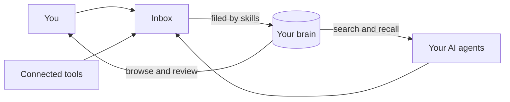

Cortex gives you and your AI agents a shared memory. Everything worth keeping, from meeting notes and documents to agent conversations, gets captured, filed, and made searchable in one place. Your agents connect to it directly, so what one conversation learns, every future conversation can recall.

Think of Cortex as a filing cabinet with a librarian. You (and your agents) drop things into the tray on top. The librarian reads each item, files it in the right place, and notes where it came from. When you or an agent asks a question later, the answer comes back with its sources.

<CardGroup cols={2}>
  <Card title="Quickstart" icon="rocket" href="/quickstart">
    From new account to an agent that remembers, in about ten minutes.
  </Card>
  <Card title="Core Concepts" icon="brain" href="/core-concepts">
    Brain, page, inbox, skill, connection: the five ideas everything is built on.
  </Card>
  <Card title="Connect Your AI" icon="plug" href="/connect/how-connections-work">
    Give Claude, ChatGPT, or any MCP client access to your brain.
  </Card>
  <Card title="API Reference" icon="code" href="/reference/api">
    Push content into Cortex from your own scripts and integrations.
  </Card>
</CardGroup>

## How Cortex works

## Two promises Cortex keeps by design

<CardGroup cols={2}>
  <Card title="Everything you capture is private first" icon="lock" href="/brains/your-personal-brain">
    Your personal brain cannot be shared, ever. It is the safe default for everything you capture.
  </Card>
  <Card title="Nothing reaches a shared brain by accident" icon="shield-check" href="/brains/shared-brains">
    Writing to a shared brain is always a deliberate act: a connection you approved, into a brain you chose.
  </Card>
</CardGroup>

## Explore by topic

<CardGroup cols={3}>
  <Card title="Brains" icon="database" href="/brains/what-is-a-brain">
    Understand personal and shared brains, templates, and how to promote knowledge.
  </Card>
  <Card title="Capturing Information" icon="inbox" href="/capture/the-inbox">
    Upload files, capture meetings, and pipe in agent conversations automatically.
  </Card>
  <Card title="Filing & Recall" icon="magnifying-glass" href="/filing/search-and-recall">
    How skills file your knowledge and how semantic search brings it back.
  </Card>
  <Card title="Teams" icon="users" href="/teams/workspaces">
    Workspaces, shared brains, roles, and patterns for team knowledge.
  </Card>
  <Card title="Webhooks" icon="webhook" href="/reference/webhooks">
    Let any tool push content into a brain over HTTP.
  </Card>
  <Card title="FAQ" icon="circle-question" href="/faq">
    Common questions about how Cortex works.
  </Card>
</CardGroup>
