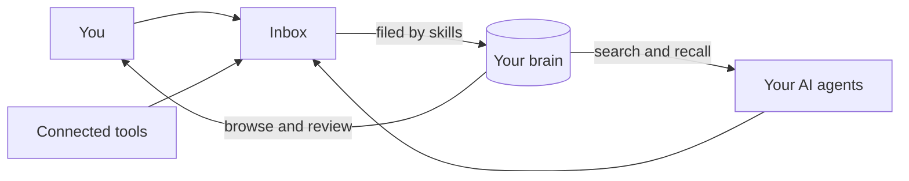

Cortex is a memory for you and your AI agents. Everything worth keeping, from meeting notes to documents to the conversations you have with your agents, gets captured, filed and made searchable in one place. Your agents connect to it directly, so what one conversation learns, every future conversation can recall.

Think of a Cortex brain as a filing cabinet with a librarian. You (and your agents, and your connected tools) drop things into the tray on top. The librarian reads each item, files it in the right place, and writes down where it came from. When you or an agent asks a question later, the answer comes back with its sources.

## Where to start

<CardGroup cols={2}>
  <Card title="Quickstart" icon="rocket" href="/quickstart">
    From new account to an agent that remembers, in about ten minutes.
  </Card>
  <Card title="Core concepts" icon="brain" href="/core-concepts">
    The five ideas everything else is built on, each in two sentences.
  </Card>
  <Card title="Your work brain" icon="lock" href="/brains/your-personal-brain">
    Why everything you capture starts somewhere only you can see.
  </Card>
  <Card title="The inbox" icon="inbox" href="/capture/the-inbox">
    How information gets in, and why nothing is ever filed behind your back.
  </Card>
</CardGroup>

## The promise

Two things are true in Cortex by design, not by policy:

1. **Everything you capture lands somewhere only you can see.** Your own brain starts with a member list of one, you, and nobody can see into a brain they are not a member of. Ambient capture (agent conversations, quick uploads, connected tools) defaults there.
2. **Nothing reaches a shared brain by accident.** Every write names its destination brain, agents can only write where you can write, and sharing something private is always a deliberate act: a [promotion](/brains/promoting) you chose to make.
